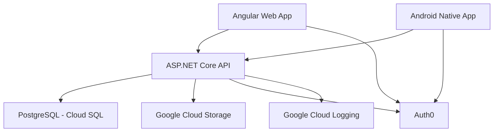

# Noon Online (Defunct)

Noon Online was an educational platform designed to provide Afghan children with access to standardized curricula through mobile and web applications, tracking student progress to enhance learning accessibility.

## My Contributions

As CTO, I joined the project in its late stages and enhanced development and deployment workflows:

- Developed a CI/CD pipeline to automate builds and deployments, enabling the team to focus on engineering tasks.
- Implemented a QA workflow to catch and resolve issues before they reached users.
- Optimized the codebase for API performance, memory usage, and stability to prevent crashes.

Though now defunct, this project highlights my skills in process automation, quality assurance, and performance optimization across a multi-platform application.

> This architecture was in the middle of migration towards Clean Architecture when the project had to be shut down. See [here](https://github.com/spiceFlowMatrix/BridgeTrunk) for the WIP migration.

## DevOps/Stack Highlights

> **Note:** This project relies on several services from Google Cloud Platform and Auth0, so a live demo isn’t available. The repository includes CI/CD configurations, Helm chart, and Dockerfiles used in production.

- [`.gitlab-ci.yml`](./.gitlab-ci.yml): Automated building, and deployment for multi-environment setups.
- Two main Dockerfiles to containerize API and web app (built in the `.gitlab-ci.yml`), supporting dual builds and deployments for different content pipelines and languages.
- [Helm Chart](./chart/Chart.yaml): Managed Kubernetes deployments on GKE.

## Tech Stack

- **Backend:** ASP.NET Core (REST API)
- **Web Frontend:** Angular
- **Mobile:** Android Native
- **Database:** PostgreSQL
- **CI/CD:** GitLab, Docker, Kubernetes, Helm
- **Cloud:** Google Cloud Platform, Cloud SQL, Logging, Cloud Storage

## System Architecture



<!-- ## How to run the application in a Windows 10 or Ubuntu 18.04.04 LTS.

### Run angular applications

#### To a Run application on Windows

First, we required to install Nodejs which you can get from [here](https://nodejs.org/en/download/)

After installing node js we have to install angular with the command

```bash
npm install -g @angular/cli
```

After installing angular we have to go to the appropriate repo in order to run applications.

To run we need 2 commands :

```bash
npm install
ng serve -o (To run the application in a local environment)
ng build --prod (To make a build of the repo to deploy it on the server which process create build in dist folder)
```

#### To a Run application on Ubuntu

First, install Nodejs from below commands

```bash
sudo apt-get update
sudo apt-get install nodejs
sudo apt-get install npm
```

After the above command executed successfully now, it turns to install angular environment and you can install it following below commands :

```bash
npm install -g @angular/cli
```

After installing angular we have to go to the appropriate repo in order to run applications.

To run we need 2 commands:

```bash
npm install
ng serve -o (To run the application in a local environment)
ng build --prod (To make a build of the repo to deploy it on the server which process create build in dist folder)
```

### Run .Net core application

#### Run .Net core in Windows

Make sure that you've installed Visual Studio 2017 or above

Download and install .net core latest SDK from [here](https://dotnet.microsoft.com/download)

Download and install .net core runtime from [here](https://dotnet.microsoft.com/download)

After successful installation open project in visual studio

Right-click On Training24Admin > Build

Now after a successful build, you can run the project by click F5 or option provided in the toolbar

To publish code you can right-click on Traning24Admin > Publish, incase you need to deploy your application on the server

#### Run .Net core in Ubuntu

The first thing to do is to install the necessary repository. To do this, open a terminal window and issue the following commands:

```bash
wget -q https://packages.microsoft.com/config/ubuntu/18.04/packages-microsoft-prod.deb
sudo dpkg -i packages-microsoft-prod.deb
```

Once the repository has been added, there's a single dependency that must be installed. Do this with the following commands:

```bash
sudo add-apt-repository universe
sudo apt-get install apt-transport-https
```

Finally, install DotNet Core with these commands:

```bash
sudo apt-get update
sudo apt-get install dotnet-sdk-2.1 <replace with the latest version want to use>
```

Build all class libraries from the solution

```bash
dotnet build
```

Locate to the main folder and run application

```bash
dotnet run
```

To publish code in release mode using below command:

```bash
dotnet publish -c Release
```

### To run hosted applications (web apps) via docker image

[Here](https://www.whitehorses.nl/blog/running-angular-application-docker-dummies) you got the best explanation for running angular web app via docker image for angular apps.

[Here](https://docs.microsoft.com/en-us/dotnet/core/docker/build-container)
you got the explanation and tutorial to run .net core app via docker image.

### The full list of prerequisite infrastructure for the application and critical configuration guidelines for them.

#### For angular web apps

There’s no prerequisite infrastructure for the application

#### For .Net Core app

There’s no prerequisite infrastructure for the application

### The full list of system environment variables required to run the application in its target environment

| Enviroment Variable name     | Porpose                                                                                                     | Example Values                                                                                                                               |
| ---------------------------- | ----------------------------------------------------------------------------------------------------------- | -------------------------------------------------------------------------------------------------------------------------------------------- |
| `ASPNETCORE_ENVIRONMENT`     | this one is for hosting environment like development or production                                          | ex `Staging` or `Production`                                                                                                                 |
| `ASPNET_DB_CONNECTIONSTRING` | database connection string                                                                                  | ex `server=ServerDetails;user id=UserName;database=NameOfDB;SslMode=none;Convert Zero Datetime=true;Allow User Variables=true;CharSet=utf8;` |
| `MANAGEMENTURL_ENVIRONMENT`  | this one is for Auth0 management environment                                                                | ex `https://yourdomain.auth0.com/oauth/token`                                                                                                |
| `CLIENT_ID_ENVIRONMENT`      | this one is for Auth0 client id                                                                             | ex`Provide your auth0 client id`                                                                                                             |
| `CLIENT_SECRET_ENVIRONMENT`  | this one is for client secret                                                                               | ex `Provide your auth0 client secret key`                                                                                                    |
| `AUDIENCE_ENVIRONMENT`       | this one for Auth0 audience environment                                                                     | ex `https://yourdomain.auth0.com/api/v2/`                                                                                                    |
| `DOMAINNAME_ENVIRONMENT`     | this one is for domain name with Auth0                                                                      | ex `yourdomain.auth0.com`                                                                                                                    |
| `PRIMARY_DOMAIN`             | domain provider of email server                                                                             | ex `smtp.gmail.com`                                                                                                                          |
| `PRIMARY_PORT`               | email provider port                                                                                         | ex `587`                                                                                                                                     |
| `USERNAME_EMAIL`             | your support email account                                                                                  | ex `yourmail@mail.com`                                                                                                                       |
| `USERNAME_PASSWORD`          | support email account password                                                                              | ex `test@test`                                                                                                                               |
| `LANGUAGE`                   | use fa for dari and pa for pashto if null then it consider as English                                       | ex `fa`                                                                                                                                      |
| `URLS`                       | use for listing application on port that we specified you need to mention both http and https url           | ex `http://*:80;https://*:443`                                                                                                               |
| `CLIENT_ID`                  | this one is for angular app, optional because it's already set in above named with `CLIENT_ID_ENVIRONMENT`  | ex`Provide your auth0 client id`                                                                                                             |
| `AUTH_DOMAIN`                | this one is for angular app, optional because it's already set in above named with `DOMAINNAME_ENVIRONMENT` | ex `yourdomain.auth0.com`                                                                                                                    |
| `AUDIENCE`                   | this one is for angular app, optional because it's already set in above named with `AUDIENCE_ENVIRONMENT`   | ex `https://yourdomain.auth0.com/api/v2/`                                                                                                    |

### The full list of system environment variables required to successfully perform the CI/CD process for the application.

| Enviroment Variable name     | Porpose                                                                                                     | Example Values                                                                                                                               |
| ---------------------------- | ----------------------------------------------------------------------------------------------------------- | -------------------------------------------------------------------------------------------------------------------------------------------- |
| `ASPNETCORE_ENVIRONMENT`     | this one is for hosting environment like development or production                                          | ex `Staging` or `Production`                                                                                                                 |
| `ASPNET_DB_CONNECTIONSTRING` | database connection string                                                                                  | ex `server=ServerDetails;user id=UserName;database=NameOfDB;SslMode=none;Convert Zero Datetime=true;Allow User Variables=true;CharSet=utf8;` |
| `MANAGEMENTURL_ENVIRONMENT`  | this one is for Auth0 management environment                                                                | ex `https://yourdomain.auth0.com/oauth/token`                                                                                                |
| `CLIENT_ID_ENVIRONMENT`      | this one is for Auth0 client id                                                                             | ex`Provide your auth0 client id`                                                                                                             |
| `CLIENT_SECRET_ENVIRONMENT`  | this one is for client secret                                                                               | ex `Provide your auth0 client secret key`                                                                                                    |
| `AUDIENCE_ENVIRONMENT`       | this one for Auth0 audience environment                                                                     | ex `https://yourdomain.auth0.com/api/v2/`                                                                                                    |
| `DOMAINNAME_ENVIRONMENT`     | this one is for domain name with Auth0                                                                      | ex `yourdomain.auth0.com`                                                                                                                    |
| `PRIMARY_DOMAIN`             | domain provider of email server                                                                             | ex `smtp.gmail.com`                                                                                                                          |
| `PRIMARY_PORT`               | email provider port                                                                                         | ex `587`                                                                                                                                     |
| `USERNAME_EMAIL`             | your support email account                                                                                  | ex `yourmail@mail.com`                                                                                                                       |
| `USERNAME_PASSWORD`          | support email account password                                                                              | ex `test@test`                                                                                                                               |
| `LANGUAGE`                   | use fa for dari and pa for pashto if null then it consider as English                                       | ex `fa`                                                                                                                                      |
| `URLS`                       | use for listing application on port that we specified you need to mention both http and https url           | http://_:80;https://_:443                                                                                                                    |
| `CLIENT_ID`                  | this one is for angular app, optional because it's already set in above named with `CLIENT_ID_ENVIRONMENT`  | ex`Provide your auth0 client id`                                                                                                             |
| `AUTH_DOMAIN`                | this one is for angular app, optional because it's already set in above named with `DOMAINNAME_ENVIRONMENT` | ex `yourdomain.auth0.com`                                                                                                                    |
| `AUDIENCE`                   | this one is for angular app, optional because it's already set in above named with `AUDIENCE_ENVIRONMENT`   | ex `https://yourdomain.auth0.com/api/v2/`                                                                                                    |

### Android application configuration details and documentation

#### Run Build in Terminal

##### How to build app in production

Change Credential in strings.xml file (Replace these values) from below location of repo:

```
app>src>release>res>values>strings.xml
```

Values you need to replace in string.xml file like below :

1. Open string.xml file from location that provided above.
2. Put values in front of Varible name
3. Save file in same location
4. Proceed to build application in production by following below steps

| Variable                        | Purpose                                 | Example values                            |
| ------------------------------- | --------------------------------------- | ----------------------------------------- |
| `com_auth0_client_id `          | provide your auth0 id here              | ex `your auth0 id`                        |
| `com_auth0_domain`              | provide your auth0 domain here          | ex `yourdomain.auth0.com`                 |
| `com_auth0_audience`            | this one for Auth0 audience environment | ex `https://yourdomain.auth0.com/api/v2/` |
| `com_auth0_database_connection` | Use auth0 authencation type             | ex `Username-Password-Authentication`     |
| `com_auth0_scope`               | auth0 authentication scope              | ex `openid offline_access`                |
| `BASE_URL`                      | your api hosting url                    | ex `https://yourdoamin.com/api/v1/`       |
| `YOUR_API_KEY`                  | file encryption library api key         | ex `your api key`                         |

###### Steps needs to follow:

Step 1:

Set the ADB path in the environment variable
Need to set the android SDK path.

```
Ex.= "C:\Users\Lenovo\AppData\Local\Android\sdk\platform-tools"
```

Setup Android Environment Variables refer to this link [here](http://www.automationtestinghub.com/setup-android-environment-variables/)

Step 2:

Open a command prompt and redirect to projects root folder [Enter the command to project folder]

```
Ex. = cd  "C:\Users\Lenovo\Desktop\ noon android application"
```

Step 3:

Type **gradlew assemblerelease** command.

After entering this command wait a few moments then it will display a message BUILD SUCCESSFULLY.

Step 4:

Type **gradlew installrelease** command.

This step is defined to install an APK in a device/emulator which is connected to the system via USB.

**Note: Must be connected to a device with a system via USB.**

##### How to build app in staging

Change Credential in strings.xml file (Replace these values) from below location of repo:

```
app>src>staging>res>values>strings.xml
```

Values you need to replace in string.xml file like below :

1. Open string.xml file from location that provided above.
2. Put values in front of Varible name
3. Save file in same location
4. Proceed to build application in production by following below steps

| Variable                        | Purpose                                 | Example values                            |
| ------------------------------- | --------------------------------------- | ----------------------------------------- |
| `com_auth0_client_id `          | provide your auth0 id here              | ex `your auth0 id`                        |
| `com_auth0_domain`              | provide your auth0 domain here          | ex `yourdomain.auth0.com`                 |
| `com_auth0_audience`            | this one for Auth0 audience environment | ex `https://yourdomain.auth0.com/api/v2/` |
| `com_auth0_database_connection` | Use auth0 authencation type             | ex `Username-Password-Authentication`     |
| `com_auth0_scope`               | auth0 authentication scope              | ex `openid offline_access`                |
| `BASE_URL`                      | your api hosting url                    | ex `https://yourdoamin.com/api/v1/`       |
| `YOUR_API_KEY`                  | file encryption library api key         | ex `your api key`                         |

Step 1:

Set the ADB path in the environment variable
Need to set the android SDK path.

```
Ex. = "C:\Users\Lenovo\AppData\Local\Android\sdk\platform-tools "
```

Step 2:

Open a command prompt and redirect to projects root folder [Enter command project folder]

```
Ex. = cd  "C:\Users\Lenovo\Desktop\ noon android application"
```

Step 3 :

Type **gradlew assemblestaging** command.

After entering this command wait a few moments then it will display a message BUILD SUCCESSFULLY.

Step 4:

Type **gradlew installstaging** command.

This step is defined to install an APK in a device/emulator which is connected to the system via USB.

**Note : Must be connected to a device with a system via USB.**

### Generate Signed APK using Commands

Step 1:

What is keystore ?

As a security measure, Android requires that apps be signed in order to be installed. Signing an app first requires creating keystores. A keystore is a storage mechanism for security certificates. A public key certificate is used to sign an APK before deployment to services like the Google Play Store. Signing the APK in this fashion allows Google to provide a high level of certainty that future updates to your APK of the same app come from you and not some malicious third party.

Type below command in terminal

```bash
jarsigner -keystore YOUR_KEYSTORE_PATH -storepass YOUR_KEYSTORE_PASSWORD app/build/outputs/apk/release/app-release-signed.apk YOUR_KEY_ALIAS
```

`YOUR_KEYSTORE_PATH` - path for keystore file that you created.

`YOUR_KEYSTORE_PASSWORD` - password for keystore file, this will be set during genration of keystore file. after we need to use same password everytime to sign application using keystore.

Step 2:

Zipaligning the apk

What is ziplingn?

zipalign is an archive alignment tool that provides important optimization to Android application (APK) files. The purpose is to ensure that all uncompressed data starts with a particular alignment relative to the start of the file. Specifically, it causes all uncompressed data within the APK, such as images or raw files, to be aligned on 4-byte boundaries. This allows all portions to be accessed directly with mmap() even if they contain binary data with alignment restrictions. The benefit is a reduction in the amount of RAM consumed when running the application.

This tool should always be used to align your APK file before distributing it to end-users. The Android build tools can handle this for you. Android Studio automatically aligns your APK.

Type below command in terminal :

```bash
your_android-sdk_path/android-sdk/build-tools/your_build_tools_version/zipalign -v 4 app/build/outputs/apk/release/app-release-signed.apk release.apk
```

**Note : Please refer below links in case of genration of keystore and setup too:**

https://stackoverflow.com/questions/50705658/how-to-sign-an-apk-through-command-line

https://developer.android.com/studio/build/building-cmdline#sign_cmdline

### For replace SSL certs in application

The SSL Certificate require to verify BASE_URL for api endpoints.

You can use SSL certificate that is used in your api server, download .crt file from your certificate provider and put in application with below location to inject and use verify api endpoints.

From below location, you can change SSL certs, please make sure while replacing keep naming convention same to avoid error and build fails :

```
AndroidApp>app>src>main>res>raw>noonssl.crt
```

### For google-services.json file in the application

goole-services.json file used for pushnotification and google service like firebase. interage in application.

google-services.json file contains all require information about project and credentails information in it that is used in application while using any of google service.

From below step you can find and download google-service.json file :

1. Signin in to [Firebase](https://console.firebase.google.com/u/0/)
2. Click on project if already exist
3. Click Setting Icon, then select Project settings.
4. In the Your apps card, select the platform for the app you want created.
5. Click google-services.json, then add it to your app.

From below location you can find the google-services.json file and you can change or replace if needed :

```
AndroidApp>app>google-services.json
``` -->
